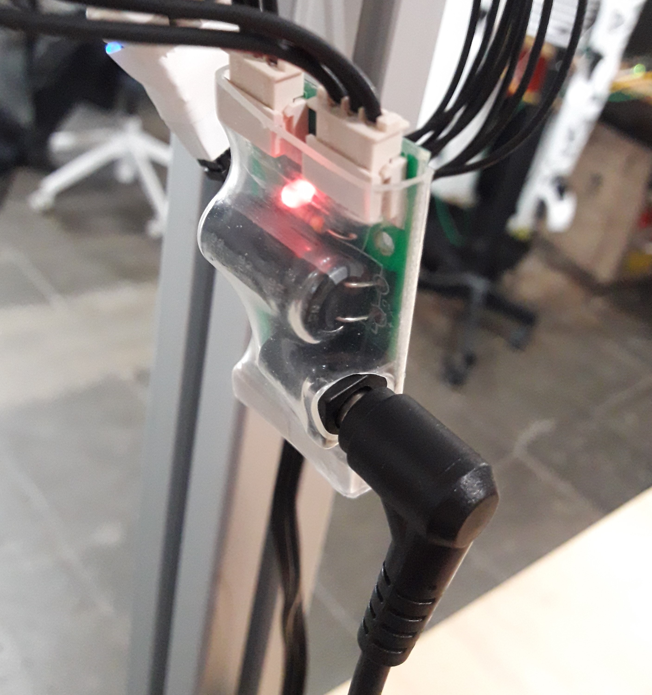
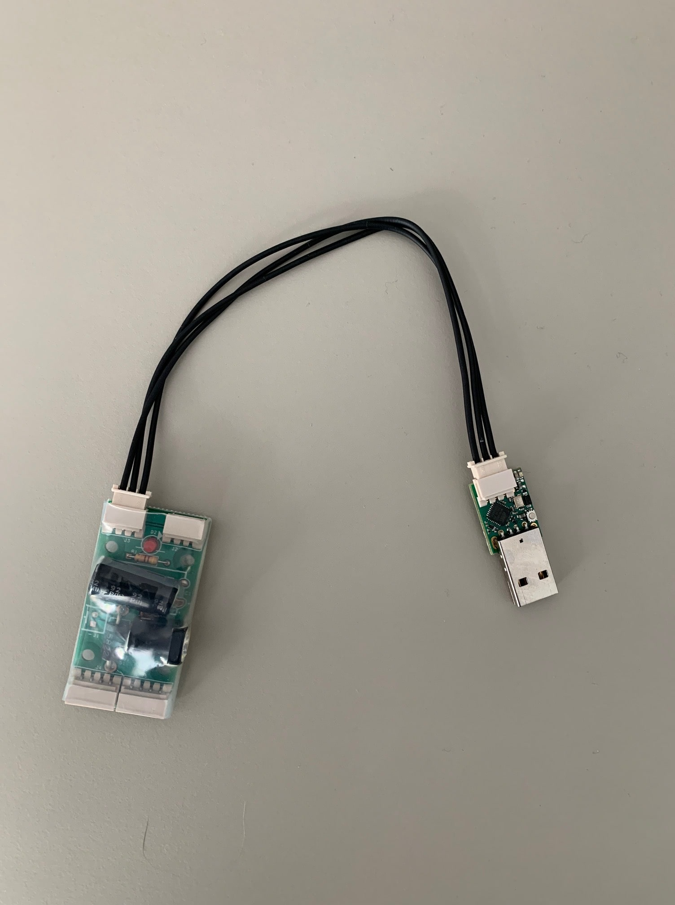

## Full/Starter kit

Connect the power supply to the robot (g) placement on the [robot back interface].  

Orbita neck needs to start in a straight position for its initialization. To do so, position the head so that Reachy looks straight ahead. (Don’t worry, the position doesn’t need to be exact, it just has to be correctly oriented).  

You have two buttons behind the robot:
- (a) : turn on/off Reachy’s embedded computer
- (h) : turn on/off alimentation of Reachy’s motors

## Arm kit

Plug the power supply on your arm on element (1):

The led should turn red.  

Connect directly the the [USB2AX board](https://www.seeedstudio.com/USB2AX-p-1349.html) to your computer and you should be good to go! The USB2AX board should be connected with a three wires Dynamixel cable to the power supply board as well.

